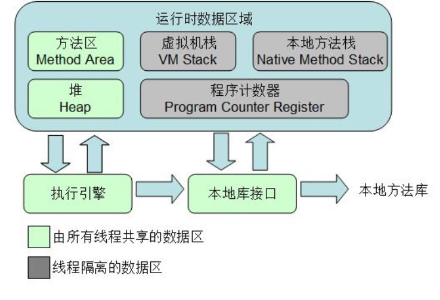

# JVM 

    它使得 Java 程序员在编写程序的时候不再需要考虑内存管理。垃圾回收器 通常是作为一个单独的低级别的线程运行,不可预知的情况下对内存堆中已经 死亡的或者长时间没有使用的对象进行清除和回收,程序员不能实时的调用垃 圾回收器对某个对象或所有对象进行垃圾回收。程序员可以手动执行 System.gc(),通知 GC 运行,但是 Java 语言规范并不保证 GC 一定会执行

## 1. 说一下java的垃圾回收机制  

## 2. JVM 的 4 种引用和使用场景

这 4 种级别由高到低依次为:强引用、软引用、弱引用和虚引用。 

* 强引用(StrongReference) 强引用是使用最普遍的引用。如果一个对象具有强引用,那垃圾回收器绝不会回收它。当内存空间不足,Java 虚拟机宁愿抛出 OutOfMemoryError 错误, 使程序异常终止,也不会靠随意回收具有强引用的对象来解决内存不足的问 题。 ps:强引用其实也就是我们平时 A a = new A()这个意思。

* 软引用(SoftReference) 如果一个对象只具有软引用,则内存空间足够,垃圾回收器就不会回收它;如果内存空间不足了,就会回收这些对象的内存。只要垃圾回收器没有回收它, 该对象就可以被程序使用。软引用可用来实现内存敏感的高速缓存(下文给出 示例)。软引用可以和一个引用队列(ReferenceQueue)联合使用,如果软引用所 引用的对象被垃圾回收器回收,Java 虚拟机就会把这个软引用加入到与之关联 的引用队列中。

* 弱引用(WeakReference) 弱引用与软引用的区别在于：只具有弱引用的对象拥有更短暂的生命周期。在垃圾回收器线程扫描它所管辖的内存区域的过程中，一旦发现了只具有弱引用的对象，不管当前内存空间足够与否,都会回收它的内存。不过由于垃圾回收器是一个优先级很低的线程，因此不一定会很快发现那些只具有弱引用的对象。
弱引用可以和一个引用队列(ReferenceQueue)联合使用，如果弱引用所引用的对象被垃圾回收,Java 虚拟机就会把这个弱引用加入到与之关联的引用队列中。

* 虚引用(PhantomReference) “虚引用”顾名思义。就是形同虚设，与其他几种引用都不同，虚引用并不会决定对象的生命周期。如果一个对象仅持有虚引用，那么它就和没有任何引用。虚引用主要用来跟踪对象被垃圾回收器回收的活动。虚引用与软引用和弱 引用的一个区别在于：虚引用必须和引用队列 (ReferenceQueue) 联合使用。 当垃圾回收器准备回收一个对象时，如果发现它还有虚引用,就会在回收对象 的内存之前,把这个虚引用加入到与之关联的引用队列中。

## 3. 说一下引用计数法与可达性分析算法

引用计数法(ReferenceCounting)

* 算法

    给对象中添加一个引用计数器，每当有一个地方引用他时，计数器值就+1，当引用失效时，计数器值就-1；任何时刻计数器为0的对象就是不可能在被使用。

* 优缺点

    判定效率很高，但不完全准确，因为如果出现两个对象相互引用的问题就不行了，会出现内存泄漏

可达性分析算法(Reachability Analysis)
* 算法

    通过一系列的GC Roots的对象作为起始点，从这些根节点开始向下搜索，搜索所走过的路径称为引用链（Reference Chain），当一个对象到GC Roots没有任何引用链相连时，则证明此对象是不可用的。

* 可以作为GC Roots的对象

    虚拟机栈（栈帧中的本地变量表）中引用的对象；方法区中的类静态属性引用的对象或者常量引用的对象；本地方法栈中JNI（就是native方法）引用的对象。

## 4. 堆里面的分区和各自的特点
* 年轻代

    年轻代又进一步可以划分为一个伊甸园(Eden)和两个存活区 (Survivor space),伊甸园是进行内存分配的地方,是一块连续的空闲内存区域, 在里面进行内存分配速度非常快,因为不需要进行可用内存块的查找。新对象 是总是在伊甸园中生成,只有经受住了一定的考验后才能后顺利地进入到存活 区中,这种考验是什么在后面会讲到。把存活区划分为两块,其实也是为了满 足垃圾回收的需要,因为在年轻代中经历了“回收大劫”未必就能够进入到年 老代中。系统总是把对象放在伊甸园和一个存活区(任意的一个),在垃圾回收时, 根据其存活时间被复制到另一个存活区或者年老代中,则之前的存活区和伊甸 园中剩下的都是需要被回收的对象,只对这两个区域进行清除即可,两个存活 区是交替使用,循环往复,在下一次垃圾回收时,之前被清除的存活区又用来 放置存活下来的对象了。一般来说,年轻代区域较小,而且大部分对象是需要 进行清除的,采用“复制算法”进行垃圾回收。

* 年老代

    年轻代中经历了 N 次回收后仍然没有被清除的对象,就会被放 到年老代中,都是生命周期较长的对象。对于年老代和永久代,采用一种称为 “标记-清除-压缩(Mark-Sweep-Compact)”的算法。标记的过程是找出当前 还存活的对象,并进行标记;清除则是遍历整个年老区,找到已标记的对象并 进行清除;而压缩则是把存活的对象移动到整个内存区的一端,使得另一端是 一块连续的空间,方便进行内存分配和复制。

* Minor GC
    
    当新对象生成,但在 Eden 申请空间失败时就会触发 Minor GC,对 Enden 区进行 GC,清除掉非存活的对象,并且把存活的对象移动到 Survivor 区中的其 中一个区中。前面的提到考验就是 Minor GC,也就是说对象经过了 Minor GC 才能 够进入到存活区中。这种形式的 GC 只会在年轻代中进行,因为大部分对象都是从 Eden 区开始的,同时 Eden 区不会分配得太大,所以对 Eden 区的 GC 会非常地频繁。

* Full GC

    对整个内存进行整理,包括了年轻代、年老代和持久代。Full GC 要对整个块进行回收,所以要比 Minor GC 慢得多,因此应该尽可能减少 Full GC 的次数。

* 内存分配规则

    1. 对象优先分配在Eden区,如果Eden区没有足够的空间时,虚拟机执行一次Minor GC。
    2. 大对象直接进入老年代(大对象是指需要大量连续内存空间的对象)。这样做的目的是 避免在 Eden 区和两个 Survivor 区之间发生大量的内存拷贝(新生代采用复制算法收集 内存)。
    3. 长期存活的对象进入老年代。虚拟机为每个对象定义了一个年龄计数器,如果对象经过 了 1 次 Minor GC 那么对象会进入 Survivor 区,之后每经过一次 Minor GC 那么对象 的年龄加 1,直到达到阀值,对象进入老年区。
    4. 动态判断对象的年龄。如果 Survivor 区中相同年龄的所有对象大小的总和大于 Survivor 空间的一半,年龄大于或等于该年龄的对象可以直接进入老年代。
    5. 空间分配担保。每次进行 Minor GC 时,JVM 会计算 Survivor 区移至老年区的对象的 平均大小,如果这个值大于老年区的剩余值大小则进行一次 Full GC,如果小于检查 HandlePromotionFailure 设置,如果 true 则只进行 Monitor GC,如果 false 则进 行Full GC。

## 5. 什么是内存泄露和内存溢出

* 内存泄漏

        不再会被使用的对象的内存不能被回收，就是内存泄露。

1. 单利模式持有对象容易造成内存泄漏
2. 提供了close()方法的对象
3. 匿名内部类会隐式持有外部类的引用
4. 容器中的对象没有合理的置空

建议：
1. 避免在循环中创建对象。 
2. 尽早释放无用对象的引用。(最基本的建议)
3. 尽量少用静态变量,因为静态变量存放在永久代(方法区),永久代基本不 参与垃圾回收。

* 内存溢出

1. 虚拟机栈和本地方法栈溢出。如果线程请求的栈深度大于虚拟机所允许的最大深度,将抛出 StackOverflowError 异常。如果虚拟机在扩展栈时无法申请到足够的内存空间,则抛出 OutOfMemoryError 异常。
2. 堆溢出。一般的异常信息:java.lang.OutOfMemoryError:Java heap spaces。
3. 方法区溢出 异常信息：java.lang.OutOfMemoryError:PermGen space。
4. 运行时常量池溢出。异常信息:java.lang.OutOfMemoryError:PermGen space。

## 6. 如何减少 gc 次数
* 对象不用时最好显式置为 Null

    一般而言,为 Null 的对象都会被作为垃圾处理,所以将不用的对象显式地设 为 Null,有利于 GC 收集器判定垃圾,从而提高了 GC 的效率。

* 尽量少用 System.gc()

    此函数建议 JVM 进行主 GC,虽然只是建议而非一定,但很多情况下它会触发 主 GC,从而增加主 GC 的频率,也即增加了间歇性停顿的次数。

* 尽量少用静态变量
    静态变量属于全局变量,不会被 GC 回收,它们会一直占用内存。

* 尽量使用 StringBuffer,而不用 String 来累加字符串。
    
    由于 String 是固定长的字符串对象,累加 String 对象时,并非在一个 String 对象中扩增,而是重新创建新的 String 对象,如 Str5=Str1+Str2+Str3+Str4,这条 语句执行过程中会产生多个垃圾对象,因为对次作“+”操作时都必须创建新 的 String 对象,但这些过渡对象对系统来说是没有实际意义的,只会增加更多 的垃圾。避免这种情况可以改用 StringBuffer 来累加字符串,因 StringBuffer 是可变长的,它在原有基础上进行扩增,不会产生中间对象。

* 分散对象创建或删除的时间
    集中在短时间内大量创建新对象,特别是大对象,会导致突然需要大量内 存,JVM 在面临这种情况时,只能进行主 GC,以回收内存或整合内存碎片,从 而增加主 GC 的频率。集中删除对象,道理也是一样的。它使得突然出现了大量的垃圾对象,空 闲空间必然减少,从而大大增加了下一次创建新对象时强制主 GC 的机会。

* 尽量少用 finalize 函数。因为它会加大 GC 的工作量,因此尽量少用 finalize 方式回收资源。

* 如果需要使用经常用到的图片,可以使用软引用类型,它可以尽可能 将图片保存在内存中,供程序调用,而不引起 OutOfMemory。

* 能用基本类型如 int,long,就不用 Integer,Long 对象
基本类型变量占用的内存资源比相应包装类对象占用的少得多,如果没 有必要,最好使用基本变量。

* 增大-Xmx 的值。

## 7. 说下几种常用的内存调试工具:jps、jmap、jhat、jstack、jconsole, jstat。
* jps:查看虚拟机进程的状况,如进程 ID。
* jmap: 用于生成堆转储快照文件(某一时刻的)。 
* jhat:对生成的堆转储快照文件进行分析。 
* jstack:用来生成线程快照(某一时刻的)。生成线程快照的主要
目的是定位线程长时停顿的原因(如死锁,死循环,等待 I/O 等), 通过查看各个线程的调用堆栈,就可以知道没有响应的线程在后台 做了什么或者等待什么资源。
* jstat:虚拟机统计信息监视工具。如显示垃圾收集的情况,内存使 用的情况。
* Jconsole:主要是内存监控和线程监控。内存监控:可以显示内存 的使用情况。线程监控:遇到线程停顿时,可以使用这个功能。

## 8. 描述 Java 类加载器的工作原理及其组织结构

