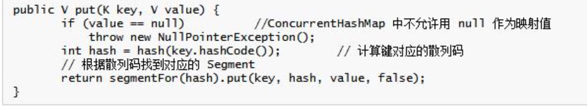

# JVM 

    它使得 Java 程序员在编写程序的时候不再需要考虑内存管理。垃圾回收器 通常是作为一个单独的低级别的线程运行,不可预知的情况下对内存堆中已经 死亡的或者长时间没有使用的对象进行清除和回收,程序员不能实时的调用垃 圾回收器对某个对象或所有对象进行垃圾回收。程序员可以手动执行 System.gc(),通知 GC 运行,但是 Java 语言规范并不保证 GC 一定会执行


## 1. 说一下java的垃圾回收机制  


## 2. JVM 的 4 种引用和使用场景

这 4 种级别由高到低依次为:强引用、软引用、弱引用和虚引用。 

* 强引用(StrongReference) 强引用是使用最普遍的引用。如果一个对象具有强引用,那垃圾回收器绝不会回收它。当内存空间不足,Java 虚拟机宁愿抛出 OutOfMemoryError 错误, 使程序异常终止,也不会靠随意回收具有强引用的对象来解决内存不足的问 题。 ps:强引用其实也就是我们平时 A a = new A()这个意思。

* 软引用(SoftReference) 如果一个对象只具有软引用,则内存空间足够,垃圾回收器就不会回收它;如果内存空间不足了,就会回收这些对象的内存。只要垃圾回收器没有回收它, 该对象就可以被程序使用。软引用可用来实现内存敏感的高速缓存(下文给出 示例)。软引用可以和一个引用队列(ReferenceQueue)联合使用,如果软引用所 引用的对象被垃圾回收器回收,Java 虚拟机就会把这个软引用加入到与之关联 的引用队列中。

* 弱引用(WeakReference) 弱引用与软引用的区别在于：只具有弱引用的对象拥有更短暂的生命周期。在垃圾回收器线程扫描它所管辖的内存区域的过程中，一旦发现了只具有弱引用的对象，不管当前内存空间足够与否,都会回收它的内存。不过由于垃圾回收器是一个优先级很低的线程，因此不一定会很快发现那些只具有弱引用的对象。
弱引用可以和一个引用队列(ReferenceQueue)联合使用，如果弱引用所引用的对象被垃圾回收,Java 虚拟机就会把这个弱引用加入到与之关联的引用队列中。

* 虚引用(PhantomReference) “虚引用”顾名思义。就是形同虚设，与其他几种引用都不同，虚引用并不会决定对象的生命周期。如果一个对象仅持有虚引用，那么它就和没有任何引用。虚引用主要用来跟踪对象被垃圾回收器回收的活动。虚引用与软引用和弱 引用的一个区别在于：虚引用必须和引用队列 (ReferenceQueue) 联合使用。 当垃圾回收器准备回收一个对象时，如果发现它还有虚引用,就会在回收对象 的内存之前,把这个虚引用加入到与之关联的引用队列中。

## 3. 说一下引用计数法与可达性分析算法

引用计数法(ReferenceCounting)

* 算法

    给对象中添加一个引用计数器，每当有一个地方引用他时，计数器值就+1，当引用失效时，计数器值就-1；任何时刻计数器为0的对象就是不可能在被使用。

* 优缺点

    判定效率很高，但不完全准确，因为如果出现两个对象相互引用的问题就不行了，会出现内存泄漏

可达性分析算法(Reachability Analysis)
* 算法

    通过一系列的GC Roots的对象作为起始点，从这些根节点开始向下搜索，搜索所走过的路径称为引用链（Reference Chain），当一个对象到GC Roots没有任何引用链相连时，则证明此对象是不可用的。

* 可以作为GC Roots的对象

    虚拟机栈（栈帧中的本地变量表）中引用的对象；方法区中的类静态属性引用的对象或者常量引用的对象；本地方法栈中JNI（就是native方法）引用的对象。


## 4. 堆里面的分区和各自的特点
* 年轻代

    年轻代又进一步可以划分为一个伊甸园(Eden)和两个存活区 (Survivor space),伊甸园是进行内存分配的地方,是一块连续的空闲内存区域, 在里面进行内存分配速度非常快,因为不需要进行可用内存块的查找。新对象 是总是在伊甸园中生成,只有经受住了一定的考验后才能后顺利地进入到存活 区中,这种考验是什么在后面会讲到。把存活区划分为两块,其实也是为了满 足垃圾回收的需要,因为在年轻代中经历了“回收大劫”未必就能够进入到年 老代中。系统总是把对象放在伊甸园和一个存活区(任意的一个),在垃圾回收时, 根据其存活时间被复制到另一个存活区或者年老代中,则之前的存活区和伊甸 园中剩下的都是需要被回收的对象,只对这两个区域进行清除即可,两个存活 区是交替使用,循环往复,在下一次垃圾回收时,之前被清除的存活区又用来 放置存活下来的对象了。一般来说,年轻代区域较小,而且大部分对象是需要 进行清除的,采用“复制算法”进行垃圾回收。

* 年老代

    年轻代中经历了 N 次回收后仍然没有被清除的对象,就会被放 到年老代中,都是生命周期较长的对象。对于年老代和永久代,采用一种称为 “标记-清除-压缩(Mark-Sweep-Compact)”的算法。标记的过程是找出当前 还存活的对象,并进行标记;清除则是遍历整个年老区,找到已标记的对象并 进行清除;而压缩则是把存活的对象移动到整个内存区的一端,使得另一端是 一块连续的空间,方便进行内存分配和复制。

* Minor GC
    
    当新对象生成,但在 Eden 申请空间失败时就会触发 Minor GC,对 Enden 区进行 GC,清除掉非存活的对象,并且把存活的对象移动到 Survivor 区中的其 中一个区中。前面的提到考验就是 Minor GC,也就是说对象经过了 Minor GC 才能 够进入到存活区中。这种形式的 GC 只会在年轻代中进行,因为大部分对象都是从 Eden 区开始的,同时 Eden 区不会分配得太大,所以对 Eden 区的 GC 会非常地频繁。

* Full GC

    对整个内存进行整理,包括了年轻代、年老代和持久代。Full GC 要对整个块进行回收,所以要比 Minor GC 慢得多,因此应该尽可能减少 Full GC 的次数。

* 内存分配规则

    1. 对象优先分配在Eden区,如果Eden区没有足够的空间时,虚拟机执行一次Minor GC。
    2. 大对象直接进入老年代(大对象是指需要大量连续内存空间的对象)。这样做的目的是 避免在 Eden 区和两个 Survivor 区之间发生大量的内存拷贝(新生代采用复制算法收集 内存)。
    3. 长期存活的对象进入老年代。虚拟机为每个对象定义了一个年龄计数器,如果对象经过 了 1 次 Minor GC 那么对象会进入 Survivor 区,之后每经过一次 Minor GC 那么对象 的年龄加 1,直到达到阀值,对象进入老年区。
    4. 动态判断对象的年龄。如果 Survivor 区中相同年龄的所有对象大小的总和大于 Survivor 空间的一半,年龄大于或等于该年龄的对象可以直接进入老年代。
    5. 空间分配担保。每次进行 Minor GC 时,JVM 会计算 Survivor 区移至老年区的对象的 平均大小,如果这个值大于老年区的剩余值大小则进行一次 Full GC,如果小于检查 HandlePromotionFailure 设置,如果 true 则只进行 Monitor GC,如果 false 则进 行Full GC。

## 5. 什么是内存泄露和内存溢出

* 内存泄漏

        不再会被使用的对象的内存不能被回收，就是内存泄露。

1. 单利模式持有对象容易造成内存泄漏
2. 提供了close()方法的对象
3. 匿名内部类会隐式持有外部类的引用
4. 容器中的对象没有合理的置空

建议：
1. 避免在循环中创建对象。 
2. 尽早释放无用对象的引用。(最基本的建议)
3. 尽量少用静态变量,因为静态变量存放在永久代(方法区),永久代基本不 参与垃圾回收。

* 内存溢出

1. 虚拟机栈和本地方法栈溢出。如果线程请求的栈深度大于虚拟机所允许的最大深度,将抛出 StackOverflowError 异常。如果虚拟机在扩展栈时无法申请到足够的内存空间,则抛出 OutOfMemoryError 异常。
2. 堆溢出。一般的异常信息:java.lang.OutOfMemoryError:Java heap spaces。
3. 方法区溢出 异常信息：java.lang.OutOfMemoryError:PermGen space。
4. 运行时常量池溢出。异常信息:java.lang.OutOfMemoryError:PermGen space。

## 6. 如何减少 gc 次数
* 对象不用时最好显式置为 Null

    一般而言,为 Null 的对象都会被作为垃圾处理,所以将不用的对象显式地设 为 Null,有利于 GC 收集器判定垃圾,从而提高了 GC 的效率。

* 尽量少用 System.gc()

    此函数建议 JVM 进行主 GC,虽然只是建议而非一定,但很多情况下它会触发 主 GC,从而增加主 GC 的频率,也即增加了间歇性停顿的次数。

* 尽量少用静态变量
    静态变量属于全局变量,不会被 GC 回收,它们会一直占用内存。

* 尽量使用 StringBuffer,而不用 String 来累加字符串。
    
    由于 String 是固定长的字符串对象,累加 String 对象时,并非在一个 String 对象中扩增,而是重新创建新的 String 对象,如 Str5=Str1+Str2+Str3+Str4,这条 语句执行过程中会产生多个垃圾对象,因为对次作“+”操作时都必须创建新 的 String 对象,但这些过渡对象对系统来说是没有实际意义的,只会增加更多 的垃圾。避免这种情况可以改用 StringBuffer 来累加字符串,因 StringBuffer 是可变长的,它在原有基础上进行扩增,不会产生中间对象。

* 分散对象创建或删除的时间
    集中在短时间内大量创建新对象,特别是大对象,会导致突然需要大量内 存,JVM 在面临这种情况时,只能进行主 GC,以回收内存或整合内存碎片,从 而增加主 GC 的频率。集中删除对象,道理也是一样的。它使得突然出现了大量的垃圾对象,空 闲空间必然减少,从而大大增加了下一次创建新对象时强制主 GC 的机会。

* 尽量少用 finalize 函数。因为它会加大 GC 的工作量,因此尽量少用 finalize 方式回收资源。

* 如果需要使用经常用到的图片,可以使用软引用类型,它可以尽可能 将图片保存在内存中,供程序调用,而不引起 OutOfMemory。

* 能用基本类型如 int,long,就不用 Integer,Long 对象
基本类型变量占用的内存资源比相应包装类对象占用的少得多,如果没 有必要,最好使用基本变量。

* 增大-Xmx 的值。

## 7. 说下几种常用的内存调试工具:jps、jmap、jhat、jstack、jconsole, jstat。
* jps:查看虚拟机进程的状况,如进程 ID。
* jmap: 用于生成堆转储快照文件(某一时刻的)。 
* jhat:对生成的堆转储快照文件进行分析。 
* jstack:用来生成线程快照(某一时刻的)。生成线程快照的主要
目的是定位线程长时停顿的原因(如死锁,死循环,等待 I/O 等), 通过查看各个线程的调用堆栈,就可以知道没有响应的线程在后台 做了什么或者等待什么资源。
* jstat:虚拟机统计信息监视工具。如显示垃圾收集的情况,内存使 用的情况。
* Jconsole:主要是内存监控和线程监控。内存监控:可以显示内存 的使用情况。线程监控:遇到线程停顿时,可以使用这个功能。

## 8. 描述 Java 类加载器的工作原理及其组织结构

* 委托机制(双亲委派模型)。
    
    当一个类加载和初始化的时候,类仅在有需要加载的时候被加载。假设你有一个应用需要的类叫作 Abc.class,首先加载这 个类的请求由 Application 类加载器委托给它的父类加载器 Extension 类加载器, 然后再委托给 Bootstrap 类加载器。Bootstrap 类加载器 会先看看 rt.jar 中有没有 这个类,因为并没有这个类,所以这个请求又回到 Extension 类加载器,它会查 看 jre/lib/ext 目录下有没有这个类,如果这个类被 Extension 类加载器找到了, 那么它将被加载,而 Application 类加载器不会加载这个类;而如果这个类没有 被 Extension 类加载器找到,那么再由 Application 类加载器从 classpath 中寻找, 如果没找到,就会抛出异常。
    
    双亲委托机制的优点就是能够提高软件系统的安全性。因为在此机制下, 用户自定义的类加载器不可能加载本应该由父加载器加载的可靠类,从而防止 不可靠的恶意代码代替由父类加载器加载的可靠代码。如,java.lang.Object 类总 是由根类加载器加载的,其他任何用户自定义的类加载器都不可能加载含有恶 意代码的 java.lang.Object 类。

* 可见性原理是子类的加载器可以看见所有的父类加载器加载的类,而父类 加载器看不到子类加载器加载的类。

* 单一性原理是指仅加载一个类一次,这是由委托机制确保子类加载器不会 再次加载父类加载器加载过的类。

## 9. ArrayList、LinkedList、Vector 的区别和实现原理
        
        ArrayList 和 Vector 只能按顺序存储元素(从下标为0的位置开始），删除的时候,需要移位并置空,默认初始容量都是 10。ArrayList 和 Vector 基于数组实现的,LinkedList 基于双向循环链表实现的(含有头结点）

ArrayList 不具有线程安全性，用在单线程环境中，如果在并发环境下使用它们,可以用 Colletions 类中的静态方法 synchronizedList()对 ArrayList 和 LinkedList 进行调用即可。Vector 是线程安全的，即它的大部分方法都包含有关键字 synchronized，vector的效率没有 ArrayList 和 LinkedList 高。


## 10. HashMap、HashTable、LindedHashMap、ConcurrentHashMap、 WeakHashMap 的区别和实现原理。

* 首先说下 HashMap 的原理。


    * HashMap 的扩容机制:
    
        当 HashMap 中的结点个数超过数组大小*loadFactor(加载因子)时,就会进行数组扩容,loadFactor 的默认值为 0.75。也就是说,默认情况下,数组大小为 16,那么当 HashMap 中结点个数超过 16*0.75=12 的时候,就把数组的大小扩展为 2*16=32,即扩大一倍,然后 重新计算每个元素在数组中的位置,并放进去,而这是一个非常消耗性能的操作。

    * 多线程下 HashMap 出现的问题:
   
        1. 多线程 put 操作后,get 操作导致死循环,导致 cpu100%的现象。主要是多线程同时put 时,如果同时触发了 rehash 操作,会导致扩容后的 HashMap 中的链表中出现循环节 点,进而使得后面 get 的时候,会死循环。
        2. 多线程 put 操作,导致元素丢失,也是发生在多个线程对 hashmap 扩容时。


* HashMap 和 HashTable 的区别。

1. Hashtable是线程安全的,方法是Synchronized的,适合在多线程环境中使用,效率 稍低;HashMap 不是线程安全的,方法不是 Synchronized 的,效率稍高,适合在单线程环 境下使用,所以在多线程场合下使用的话,需要手动同步 HashMap, Collections.synchronizedMap()。
2. HashMap 的 key 和 value 都可以为null, HashTable 的 key 和 value 都不可以为null
3. HashMap 中数组的默认大小是 16,而且一定是2的倍数。HashTable 中数组默认大小是 11,扩容后的数组长度是之前数组长度的2倍＋1
4. 哈希值的使用不同。
        
        // HashMap 重新计算hash值，用 & 代替 %
        int hash = hash(key.hashcode();
        int i = indexFor(hash, table.length);
        static int hash(Object x) {
            int h = x.hashCode();
            h += ~(h << 9);
            h ^= (h >>> 14);
            h += (h << 4);
            h ^= (h >>>10);
            return h;
        }
        static int indexFor(int H, int length) {
            return h & (length - 1);
        }

        // HashTable 直接使用对象的 hashcode
        int hash = key.hashCode();
        int index = (hash & 0x7FFFFFFF) % tab.length;

5. 判断是否含有某键
    
    在 HashMap 中, null 可以作为键,这样的键只有一个；可以有一个或多个键所对应的值为null。当get()方法返回null时，既可以表示 HashMap 不存在该键，也可以表示该键所对应的值为 null。因此,在 HashMap 中不能用 get()方法来判断 HashM ap 中是否存在某个键,而应该用 containsKey()方法来判断。Hashtable 的键值都不能为 null，所以可以用 get()方法来判断是否含有某个键。

* ConcurrentHashMap 的原理
    
        在 ConcurrentHashMap 中,不允许用 null 作为键和值。 ConcurrentHashMap 使用分段锁技术,将数据分成一段一段的存储,然后 给每一段数据配一把锁,当一个线程占用锁访问其中一个段数据的时候,其他 段的数据也能被其他线程访问,能够实现真正的并发访问。读操作大部分时候都不需要用到锁。只有在 size 等操作时才需要锁住整个 hash 表。 它把区间按照并发级别(concurrentLevel),分成了若干个 segment。默认情 况下内部按并发级别为 16 来创建。对于每个 segment 的容量,默认情况也是 16。当然并发级别(concurrentLevel)和每个段(segment)的初始容量都是可以通 过构造函数设定的。ConcurrentHashMap 使用 segment 来分段和管理锁。segment 继承自 ReentrantLock , 因此 ConcurrentHashMap 使 ReentrantLock 来保证线程安全。
    
    可以看到除了 value 不是 final 的,其它值都是 final 的,这意味着不能从 hash 链的中间或尾部添加或删除节点,因为这需要修改 next 引用值,所有的节 点的修改只能从头部开始。为了确保读操作能够看到最新的值,将 value 设置成 volatile,这避免了加锁。

    1. get 操作
    
    
    volatile的写入操作优于读操作，即使两个线程同时修改和获取volatile变量，get操作也能拿到最新值。

    2. put操作
    
    
    

    注意:这里的加锁操作是针对某个具体的 Segment,锁定的是该 Segment 而不是整个 ConcurrentHashMap。因为插入键 / 值对操作只是在这个 Segment 包含的某个桶中完成,不需要锁定整个 ConcurrentHashMap。此时, 其他写线程对另外 15 个 Segment 的加锁并不会因为当前线程对这个 Segment 的加锁而阻塞。同时,所有读线程几乎不会因本线程的加锁而阻塞(除 非读线程刚好读到这个 Segment 中某个 HashEntry 的 value 域的值为 null,此时需要加锁后重新读取该值)。
    
    空值的唯一源头就是 HashEntry 中的默认值,因为 HashEntry 中的 value 不是 final 的,非同步读取有可能读取到空值。仔细看下 put 操作的语句: tab[index] = new HashEntry<K,V>(key, hash, first, value),在这条语句中, HashEntry 构造函数中对 value 的赋值以及对 tab[index]的赋值可能被重新排 序,这就可能导致结点的值为空。这种情况应当很罕见,一旦发生这种情况, ConcurrentHashMap 采取的方式是在持有锁的情况下再读一遍,这能够保证读 到最新的值,并且一定不会为空值。(newEntry 对象是通过 new HashEntry(K k , V v, HashEntry next) 来创建的。如果另一个线程刚好 new 这个对象时,当 前线程来 get 它。因为没有同步,就可能会出现当前线程得到的 newEntry 对象 是一个没有完全构造好的对象引用。这里同样有可能一个线程 new 这个对象的 时候还没有执行完构造函数就被另一个线程得到这个对象引用。)

    3. remove操作
    
    
    删除之前的链表
    
    删除之后的链表
    

    ```
        ConcurrentHashMap 的高并发性主要来自于三个方面: 
        1.用分离锁实现多个线程间的更深层次的共享访问。
        2.用 HashEntry 对象的不变性来降低执行读操作的线程在遍历链表期间对加锁的需求。
        3.通过对同一个 Volatile 变量的写 / 读访问,协调不同线程间读 / 写操作的内存可见性。
    ```
    
* WeakHashMap VS HashMap

WeakHashMap 中的 key 采用的是“弱引用”的方式,只要 WeakHashMap 中的 key 不再被外部引用,所对应的键值对就可以被垃圾回收器回收。
HashMap 中的 key 采用的是“强引用”的方式,当 key 不再被外部引用 时,只有当这个 key 从 HashMap 中删除后,才可以被垃圾回收器回收。

* HashMap VS TreeMap
1. 实现方式的区别: HashMap:基于哈希表实现。TreeMap:基于红黑树实现。 
2. TreeMap 能够把它保存的记录根据键排序.
3. HashMap:适用于在 Map 中插入、删除和查找元素。 Treemap:适用于按自然顺序或自定义顺序遍历键(key)。

* HashSet 实现原理

    对于 HashSet 而言,它是基于 HashMap 实现的,HashSet 底层使用 HashMap 来保存所有元素,因此 HashSet 的实现比较简单,相关 HashSet 的 操作,基本上都是直接调用底层 HashMap 的相关方法来完成。HashSet 中的元素都存放在 HashMap 的 key 上面,而 value 中的值都是统一的一个 private static final Object PRESENT = new Object();

* fail-fast 机制

    例如:假设存在两个线程(线程 1、线程 2),线程 1 通过 Iterator 在遍历集合 A 中的元素,在某个时候线程 2 修改了集合 A 的结构(是结构上面的修改, 而不是简单的修改集合元素的内容),那么这个时候程序就会抛出 ConcurrentModificationException 异常,从而产生 fail-fast 机制。

    产生的原因:当调用容器的 iterator()方法返回 Iterater 对象时,把容器中包含对象 的个数赋值给了一个变量 expectedModCount,在调用 next()方法时,会比较 expectedModCount 与容器中实际对象的个数是否相等,若二者不相等,则会抛 出 ConcurrentModificationException 异常。如果在遍历集合的同时,需要删除元素的话,可以用 iterator 里面的 remove()方法删除元素。

## 11. Java 语言类问题
* 反射的作用与原理，如何提高反射效率

    定义:反射机制是在运行时,对于任意一个类,都能够知道这个类的所有属性和方法;对于任意一个对象,都能够调用它的任意一个方法。在 java 中, 只要给定类的名字,那么就可以通过反射机制来获得类的所有信息。


* java 与 c++

    1. 运行过程的不同。JAVA 源程序经过编译器编译成字节码文件,然后由 JVM 解释执行。而 C++/C 经过编译、链接后生成可执行的二进制代码。因此 C/C++ 的执行速度比 JAVA 快。
    2. 跨平台性。JAVA 可以跨平台,而 C++/C 不可以跨平台。
    3. JAVA 没有指针,C++/C 有指针。
    4. JAVA 不支持多重继承,但是可以同时实现多个接口来达到类似的目的。
    C++支持多重继承。
    5. JAVA 不需要对内存进行管理,有垃圾回收机制。C/C++需要对内存进行显
    示的管理。
    6. JAVA 不支持运算符重载。C/C++支持运算符重载。
    7. JAVA 中每个数据类型在不同的平台上所占字节数固定的,而 C/C++则不
    然。

* 并行与并发

1. Concurrency，是并发的意思。并发的实质是一个物理CPU(也可以多个物理CPU) 在若干道程序（或线程）之间多路复用，并发性是对有限物理资源强制行使多用户共享以提高效率。
2. 微观角度：所有的并发处理都有排队等候，唤醒，执行等这样的步骤，在微观上他们都是序列被处理的，如果是同一时刻到达的请求（或线程）也会根据优先级的不同，而先后进入队列排队等候执行。
3. 宏观角度：多个几乎同时到达的请求（或线程）在宏观上看就像是同时在被处理。
通俗点讲，并发就是只有一个CPU资源，程序（或线程）之间要竞争得到执行机会。图中的第一个阶段，在A执行的过程中B，C不会执行，因为这段时间内这个CPU资源被A竞争到了，同理，第二个阶段只有B在执行，第三个阶段只有C在执行。其实，并发过程中，A，B，C并不是同时在进行的（微观角度）。但又是同时进行的（宏观角度）。


1. Parallelism，即并行，指两个或两个以上事件（或线程）在同一时刻发生，是真正意义上的不同事件或线程在同一时刻，在不同CPU资源呢上（多核），同时执行。
2. 并行，不存在像并发那样竞争，等待的概念。
3. 图中，A，B，C都在同时运行（微观，宏观）

通过多线程实现并发，并行：

    java中的Thread类定义了多线程，通过多线程可以实现并发或并行。
    在CPU比较繁忙，资源不足的时候（开启了很多进程），操作系统只为一个含有多线程的进程分配仅有的CPU资源，这些线程就会为自己尽量多抢时间片，这就是通过多线程实现并发，线程之间会竞争CPU资源争取执行机会。
    在CPU资源比较充足的时候，一个进程内的多线程，可以被分配到不同的CPU资源，这就是通过多线程实现并行。
    至于多线程实现的是并发还是并行？上面所说，所写多线程可能被分配到一个CPU内核中执行，也可能被分配到不同CPU执行，分配过程是操作系统所为，不可人为控制。所有，如果有人问我我所写的多线程是并发还是并行的？我会说，都有可能。
    不管并发还是并行，都提高了程序对CPU资源的利用率，最大限度地利用CPU资源。


* Java 中的 NIO,BIO 分别是什么。NIO 主要用来解决什么问题。
    
    1. Java NIO 和 IO 之间第一个最大的区别是,IO 是面向流的,NIO 是面向缓冲区的。Java IO 面向流意味着每次从流中读一个或多个字节,直至读取所有字节, 它们没有被缓存在任何地方。此外,它不能前后移动流中的数据。在 Java NIO 中把数据读取到一个缓冲区中,需要时可在缓冲区中前后移动。这就增加了处 理过程中的灵活性。而且,需确保当更多的数据读入缓冲区时,不要覆盖缓冲区里尚未处理的数据。
    2.阻塞与非阻塞 IO
    Java IO 的各种流是阻塞的。这意味着,当一个线程调用 read() 或 write()时,该线程被阻塞,直到有一些数据被读取,或数据完全写入。该线程在此期 间不能再干任何事情了。Java NIO 的非阻塞模式,使一个线程从某通道发送请求读取数据,但是它仅能得到目前可用的数据,如果目前没有数据可用时,就什么都不会获取,而不是保持线程阻塞,所以直至数据变的可以读取之前,该线程可以继续做其他的事情。非阻塞写也是如此。一个线程请求写入一些数据到某通道, 但不需要等待它完全写入,这个线程同时可以去做别的事情。 线程通常将非阻塞 IO 的空闲时间用于在其它通道上执行 IO 操作, 所以一个单独的线程现在可以管理多个输入和输出通道(channel)。
    3.选择器(Selector)
    Java NIO 的选择器允许一个单独的线程来监视多个输入通道,你可以注册多个通道使用一个选择器,然后使用一个单独的线程来“选择”通道:这些通道里已经有可以处理的输入,或者选择已准备写入的通道。为了将 Channel 和 Selector 配合使用,必须将 channel 注册到 selector 上,通过 SelectableChannel.register()方法来实现。这种选择机制,使得一个单独的线程 很容易来管理多个通道。只要 Channel 向 Selector 注册了某种特定的事件, Selector 就会监听这些事件是否会发生,一旦发生某个事件,便会通知对应的 Channel。使用选择器,借助单一线程,就可对数量庞大的活动 I/O 通道实施监控和维护。

> NIO 的原理。

在 NIO 中有几个核心对象:缓冲区(Buffer)、通道(Channel)、选择器(Selector)。
1. 缓冲区(Buffer)
    缓冲区实际上是一个容器对象,其实就是一个数组,在 NIO 库中,所有数据都是用缓冲区处理的。在读取数据时,它是直接读到缓冲区中的;在写入数据时,它也是写入到缓冲区中的;任何时候访问 NIO 中的数据,都是将它放到缓冲区中。在 NIO 中,所有的缓冲区类型都继承于抽象类 Buffer,最常用的就 是 ByteBuffer。
    而在面向流 I/O 系统中,所有数据都是直接写入或者直接将数据读取到 Stream 对象中。


2. 通道(Channel)
    通道是一个对象,通过它可以读取和写入数据,所有数据都通过 Buffer 对象来处理。我们永远不会将字节直接写入通道中,相反是将数据写入包含一个或者多个字节的缓冲区。同样不会直接从通道中读取字节,而是将数据从通道读入缓冲区,再从缓冲区获取这个字节。通道与流的不同之处在于通道是双向的。而流只是在一个方向上移动(一个流必须是 InputStream 或者 OutputStream 的子类,比如 InputStream 只能进行读取操作,OutputStream 只能进行写操作),而通道是双向的,可以用于读、写或者同时用于读写。

    从图中可以看出,当有读或写等任何注册的事件发生时,可以从 Selector 中获得相应的SelectionKey,同时从 SelectionKey中可以找到发生的事件和该 事件所发生的具体的 SelectableChannel,以获得客户端发送过来的数据。
    
3. 选择器(Selector)
    NIO 有一个主要的类 Selector,这个类似一个观察者,只要我们把需要探知 的 socketchannel 告诉 Selector,我们接着做别的事情,当有事件发生时,他会 通知我们,传回一组 SelectionKey,我们读取这些 Key,就会获得我们刚刚注册 过的 socketchannel,然后,我们从这个 Channel 中读取数据,放心,包准能 够读到,接着我们可以处理这些数据。
    Selector 内部原理实际是在做一个对所注册的 channel 的轮询访问,不断地轮询,一旦轮询到一个 channel 有所注册的事情发生,比如数据来了,他就会站起来报告,交出一把钥匙,让我们通过这把钥匙来读取这个 channel 的内容。
    通过 Selector.select()方法来获取到达事件,在获取了到达事件之后,就可以逐 个地对这些事件进行响应处理。
    Selector 类是 NIO 的核心类,Selector 能够检测多个注册的通道上是否有事 件发生,如果有事件发生,便获取事件然后针对每个事件进行相应的响应处理。 这样一来,只是用一个单线程就可以管理多个通道,也就是管理多个连接。这 样使得只有在连接真正有读写事件发生时,才会调用函数来进行读写,就大大 地减少了系统开销,并且不必为每个连接都创建一个线程,不用去维护多个线 程,并且避免了多线程之间的上下文切换导致的开销。
